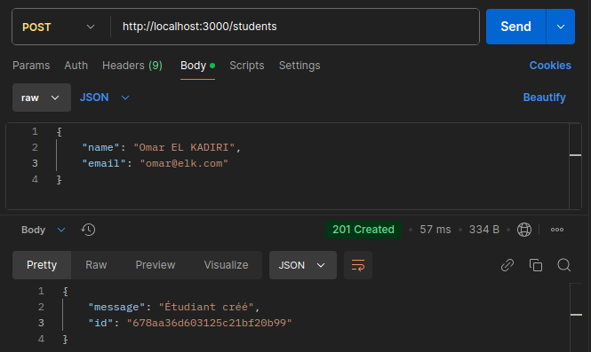

# README.md – API de Gestion des Cours et Étudiants

## Description
Cette API permet la gestion des cours et des étudiants avec une relation **plusieurs-à-plusieurs**.  
Elle inclut des fonctionnalités telles que :
- **Création, mise à jour et suppression** de cours et d'étudiants.
- **Inscription des étudiants** aux cours.
- **Récupération des cours d’un étudiant**.
- **Optimisation des performances** avec un système de **caching Redis**.

---

##  Technologies Utilisées
- **Node.js** & **Express.js** – Framework backend
- **MongoDB** – Base de données NoSQL
- **Mongoose** – ODM pour MongoDB
- **Redis** – Cache pour améliorer les performances
- **Postman** – Test des endpoints API

---

##  Installation et Configuration

### 1️.**Prérequis**
- Node.js (>= 16.x)
- MongoDB (local ou cloud)
- Redis (local ou Docker)
- Un gestionnaire de packages : `npm` ou `yarn`

### 2️. **Installation**
- Cloner le projet :
   git clone https://github.com/omarelkadiri/learning-platform-nosql
   cd learning-platform-nosql

- Installer les dépendances :
   npm install

- Configurer les variables d’environnement (.env) :
   PORT=3000
   MONGO_URI=mongodb://localhost:27017/gestion-cours
   REDIS_HOST=localhost
   REDIS_PORT=6379

- Démarrage :
   Lancer MongoDB : 
      - Debian : sudo mongod --config /etc/mongod.conf ou sudo systemctl start mongod
      - Windows : cd C:\Program Files\MongoDB\Server\5.0\bin; mongod --dbpath C:\data\db
   
   Lancer Redis : 
      - Debian : la commande bash : redis-server
      - Windows : cd C:\Program Files\Redis\64\bin; redis-server --daemonize yes
   

   --> Démarer l'API :  npm start
      Si tu utilises Docker, lance directement :  docker-compose up -d

   ## Endpoints Principaux

API REST : Gestion des Cours et des Étudiants

Cours

    Ajouter un cours: Envoyer une requête POST à l'endpoint /courses avec les informations du nouveau cours.
    Récupérer un cours: Effectuer une requête GET à l'endpoint /courses/:id en remplaçant :id par l'identifiant du cours souhaité.
    Récupérer tous les cours: Envoyer une requête GET à l'endpoint /courses.
    Modifier un cours: Effectuer une requête PUT à l'endpoint /courses/:id avec les nouvelles informations du cours.
    Supprimer un cours: Envoyer une requête DELETE à l'endpoint /courses/:id.

Étudiants

    Ajouter un étudiant: Envoyer une requête POST à l'endpoint /students avec les informations du nouvel étudiant.
    Récupérer un étudiant: Effectuer une requête GET à l'endpoint /students/:id en remplaçant :id par l'identifiant de l'étudiant souhaité.
    Récupérer tous les étudiants: Envoyer une requête GET à l'endpoint /students.
    Modifier un étudiant: Effectuer une requête PUT à l'endpoint /students/:id avec les nouvelles informations de l'étudiant.
    Supprimer un étudiant: Envoyer une requête DELETE à l'endpoint /students/:id.

Inscriptions

    Inscrire un étudiant: Envoyer une requête POST à l'endpoint /enrollments avec les identifiants de l'étudiant et du cours.
    Récupérer les cours d'un étudiant: Effectuer une requête GET à l'endpoint /students/:studentId/courses en remplaçant :studentId par l'identifiant de l'étudiant.
    Désinscrire un étudiant: Envoyer une requête DELETE à l'endpoint /enrollments/:id.

## Gestion du Cache avec Redis

+ Pour améliorer la performance, cette API utilise Redis comme cache :

   - Lorsqu’un cours ou un étudiant est récupéré, il est stocké en cache.
   - Après modification ou suppression d’une donnée, le cache correspondant est supprimé ou modifié (selon le besoin) pour éviter les incohérences.

+ Résumé des approches pour la gestion du cache après modification :

   1️. Mettre à jour le cache directement après modification

      Avantages :
      ✔️ Évite une requête MongoDB après la mise à jour.
      ✔️ Assure que les nouvelles données sont immédiatement disponibles.
      Inconvénients :
      ❌ Nécessite de trouver et modifier chaque entrée en cache concernée.
      ❌ Peut devenir complexe avec plusieurs caches pour des données similaires (ex: liste et détails d’un même objet).

   2️. Supprimer le cache après modification

      Avantages :
      ✔️ Plus simple et plus facile à gérer.
      ✔️ Lors de la prochaine requête, MongoDB sera sollicité et les données seront automatiquement rafraîchies.
      Inconvénients :
      ❌ La prochaine requête sera plus lente (requête MongoDB).
      ❌ Si plusieurs utilisateurs requêtent après la suppression du cache, MongoDB sera interrogé avant que le cache ne soit recréé.

   --> Quelle approche choisir ?

      - Si on modifie un seul élément spécifique, mettre à jour directement le cache est préférable.
      - Si la modification peut affecter plusieurs données (ex: une liste de cours, des stats, etc.), il vaut mieux supprimer le cache pour éviter des incohérences. 

# Réponses aux Questions
1. Pourquoi créer un module séparé pour les connexions aux bases de données ?

   - Réutilisabilité : Réduit la duplication de code.
   - Maintenance : Simplifie les modifications.
   - Gestion centralisée : Regroupe les paramètres critiques.
   - Sécurité : Facilite la gestion des identifiants sensibles.
   - Testabilité : Simplifie les tests.

2. Comment gérer proprement la fermeture des connexions ?

   - Gestionnaire de contexte : Automatise la fermeture après usage.
   - Pooling : Retourne les connexions au pool.
   - Gestion des exceptions : Ferme même en cas d'erreur.
   - Signal d’arrêt : Ferme les connexions avant de quitter l’application.
   - Timeouts : Évite les connexions inactives prolongées.
   

3. Pourquoi est-il important de valider les variables d'environnement au démarrage ?

   - Fiabilité : Assure que l'application dispose des informations nécessaires pour fonctionner correctement.
   - Prévention d'erreurs : Évite des comportements imprévus ou des pannes dues à des valeurs manquantes ou incorrectes.
   - Débogage simplifié : Les problèmes sont identifiés tôt, facilitant la correction.
   - Sécurité : Vérifie que les configurations sensibles (comme les clés API) sont définies et sécurisées.

4. Que se passe-t-il si une variable requise est manquante ?

   - Erreur d'exécution : L'application peut planter ou échouer à démarrer.
   - Comportement inattendu : Des valeurs par défaut non adaptées pourraient être utilisées.
   - Problèmes de sécurité : Des accès non autorisés ou une fuite d’informations peuvent survenir si des variables critiques ne sont pas définies.
   - Perte de temps : Le problème pourrait être détecté tardivement, retardant la résolution.

5. Quelle est la différence entre un contrôleur et une route ?

   - Route : Définit le chemin d'URL et la méthode HTTP (GET, POST, etc.) pour accéder à une ressource ou un service. Elle agit comme un point d'entrée pour les requêtes.
   - Contrôleur : Contient la logique associée à une route. Il traite la requête, applique la logique métier, et retourne une réponse.

      Exemple :
         Route : /api/users (GET)
         Contrôleur : Récupère les utilisateurs depuis la base de données et les retourne en réponse.

6. Pourquoi séparer la logique métier des routes ?

   - Lisibilité : Les routes restent simples et claires.
   - Réutilisabilité : La logique métier peut être utilisée ailleurs sans dépendre des routes.
   - Testabilité : Les contrôleurs et la logique métier peuvent être testés indépendamment des routes.
   - Maintenance : Les modifications sont plus faciles à gérer, car les responsabilités sont bien définies.
   - Respect des principes SOLID : Encourage une architecture propre et modulaire.

7. Pourquoi créer des services séparés ?

   - Modularité : Séparer les services permet d'avoir une architecture modulaire où chaque service a une responsabilité spécifique. Cela facilite la gestion du code et son évolution, car on peut travailler sur un service sans affecter les autres.

   - Scalabilité : En séparant les services, il devient plus facile de les scaler indépendamment selon les besoins. Par exemple, un service qui gère des requêtes lourdes peut être mis à l'échelle sans affecter les autres services.

   - Maintenance et débogage : Les services séparés permettent une maintenance plus aisée. En cas de bug, il est plus facile de localiser le problème dans un service bien délimité, ce qui facilite le débogage.

   - Réutilisabilité : Les services indépendants peuvent être réutilisés dans d'autres projets ou contextes sans nécessiter de changements majeurs dans le code.

   - Sécurité : En séparant les services, on peut appliquer des mesures de sécurité spécifiques à chaque service, limitant les risques en cas de faille dans un service.

   - Performance : Les services peuvent être optimisés pour des besoins spécifiques, ce qui peut améliorer les performances globales de l'application.

8. Comment gérer efficacement le cache avec Redis ?

   - Choisir les bons types de données : Utilisez le type de donnée le plus adapté (chaînes, listes, ensembles, etc.) pour optimiser les performances.
   - Expiration des clés : Définissez un TTL pour éviter l’accumulation de données obsolètes.
   - Stratégies de remplacement : Utilisez des stratégies comme LRU ou LFU pour gérer la mémoire.
   - Gestion des erreurs : Gérez les erreurs de connexion ou de mémoire pour assurer la stabilité du cache.
   - Pipelining : Utilisez le pipelining pour envoyer plusieurs commandes en une seule fois, améliorant ainsi la performance.
   - Surveillance et suivi : Implémentez des outils pour suivre l’utilisation du cache et détecter les goulots d'étranglement.

9. Quelles sont les bonnes pratiques pour les clés Redis ?

   - Utiliser des préfixes de clés : Organisez vos clés avec des préfixes pour une gestion plus claire.
   - Limiter la longueur des clés : Gardez les clés courtes tout en restant descriptif.
   - Utiliser des identifiants uniques : Employez des UUIDs ou des identifiants uniques pour éviter les collisions.
   - Eviter les caractères spéciaux : Préférez des caractères simples dans les clés.
   - Eviter les clés trop générales : Soyez spécifique dans le choix des clés pour éviter les conflits.
   - Surveiller les doublons : Assurez-vous qu’il n’y a pas de doublons pour éviter la surcharge du cache.
   - Expiration et nettoyage des clés : Définissez des expirations et nettoyez régulièrement les clés obsolètes.

## Captures d'écran des Tests :

Test 1 : Connection Mongodb et Redis :

Test 2 :  MongoService :

Test 3 : courseController et courseRoutes :
- test get 

- test Post 

- Test 4 : test de la gestion des etudiants et leurs inscriptions :
- ajoter étudiant : 

